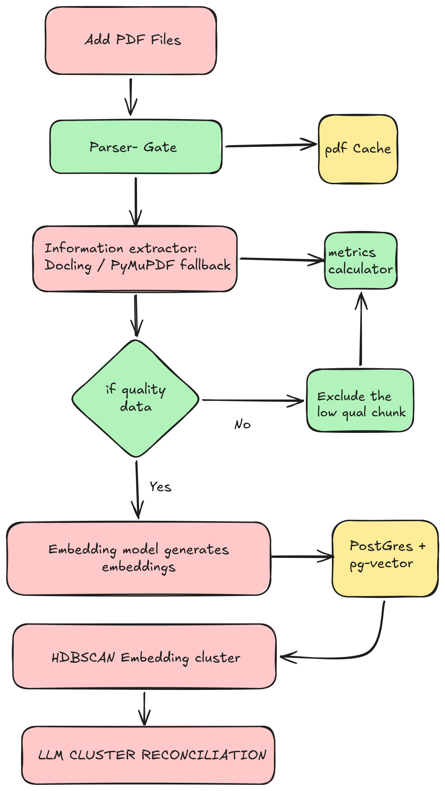

<div style="width: 500px; height: 100px; overflow: hidden; position: relative;">
  
</div>
<h1> Don't Let Large Context files slow down your work. </h1>
<p> Doc-Glue Acts like a Middle layer between your context and your Agent.</p>

## Pipeline Architecture

  

### Processing Pipeline
1. Document Ingestion and Parsing: Parses incoming PDFs using Docling (with PyMuPDF fallback).
2. Quality Filtering: Removes low-information chunks and noise before extraction.
3. Grounded Fact Extraction: Extracts structured atomic facts with page and snippet lineage.
4. Vector Indexing and Deduplication: Embeds facts and stores them in PostgreSQL with pgvector using SHA-256 content deduplication.
5. Cluster-First Reconciliation: Groups related facts vectorially and evaluates cross-document agreement and contradictions.
6. Fact Ledger: Exposes queryable reference cards via FastAPI endpoints and Streamlit UI.
### Trade-Offs
1. Reconciliation Engine: Pairwise vs. Cluster-FirstPairwise Matching: Comparing every new claim individually against K candidates produced an API bottleneck, high costs, and failed to detect multi-document timeline shifts (e.g., Doc A $\rightarrow$ Doc B $\rightarrow$ Doc C). Instead by using clustering we trade off the time taken to output for more realistic relations between facts. Singletons (unique facts) skip the LLM entirely, and candidate clusters are reconciled in a single batched prompt pass.
2. Vision LLMS vs Simple parsers Vs Layout parsers : here the choice is between complex detail extraction vs throughput. since throughput was a concern owing to our clustering algorithm we settled for
a middle ground, a document layout parser such as PyMuPDF/Docling Is still fast enough and performs decently well compared to a vision transformer. extracting text was better since it reduced input tokens and greatly saved costs.
3. PostGres+pgvector over Graph or additional vector db : Better Cost for trading off richness of data being represented, by creating tables of the data that easily scales up and is cheap compared to vector or graph db we saved costs greatly while sacrificing the "richness" of data which was fine as we already used LLM to evaluate vectors.
4. Chunk Cleanup gate vs ingestion of all chunks : Traded data loss for better data quality, Not all chunks are worth processing lowerquality chunks (usually empty or noisy) waste a lot of tokens hence
we decided to create a rule based gate that filtered out chunks that are likely to be noise and meaningless.
5. File Level SHA over semantic deduplication : Trade-off SHA-256 byte hashing provides $0 cost and 0ms latency to prevent re-processing identical uploaded files. However, it cannot detect near-duplicate documents (e.g., a PDF re-saved with minor whitespace edits or a revised date stamp), which still flow through the pipeline as new documents
### Limitations
1. Slow extraction due to clustering and embedding bottleneck : This is due to two reasons , free api key and clustering. I plan to fix this by batching all the embeddings and also by letting the clustering process work in the background. this way it will feel more realtime and dynamic.
2. No interactive visuals to see the relation between facts. More of a choice rather than a limitation, later implementations could add some sort of graph visual
3. problems with clusters on messy or complex data, The system falls out when dealing with very complex analytical data such as graphs and visual in the pdf, we can proceed a Vision LLM fallback inorder to process more complex data that parsers fail to get.
### Future Improvements

#### Small quality of life fixes
1. Add a more responsive loading bar to ensure the user that the pdf is being parsed.
2. transfer SHA 256 caching of the pdf to semantic deduplication of the data using a vector store , this allows for deduplication and those embeddings deduplicated will be verified against facts.
3. Add Asynchronous event driven parsing for a smoother experience.
#### Improvements in the pipeline
1. Improve throughput using background clustering tasks so the UI feels responsive.
2. Add better visual representation and a chat support to query an agent.
3. Add more complex fallbacks such as a Vision transformer to parse graph, tables and images when layout parsers fail.
4. Use a full-text search to check for sparse relations in the pdfs inorder to gather more possible facts.

## Tech Stack

* Backend and API: Python 3.11, FastAPI, Uvicorn, Pydantic v2
* PDF Parsing: Docling (Primary), PyMuPDF (Fallback)
* LLM and Embeddings: OpenRouter / OpenAI API, Gemini, Ollama
* Database and Vector Search: PostgreSQL 16 with pgvector, Psycopg 3
* Frontend: Streamlit
* Containerization: Docker, Docker Compose

## Local Setup

All you need is Docker.

1. Get a free API key from OpenRouter (or OpenAI).
2. Create a `.env` file from `.env.example` and set your API key:
   ```bash
   cp .env.example .env
   ```
3. Run Docker Compose:
   ```bash
   docker compose up --build
   ```

Access the Streamlit UI at `http://localhost:8501` and FastAPI docs at `http://localhost:8000/docs`.
